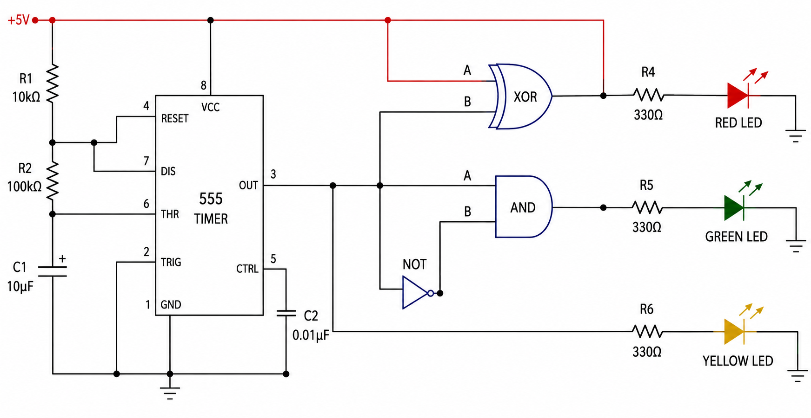

# Electronic Light Runner Using 555 Timer and Logic Gates

A fully hardware-based Electronic Light Runner system designed and implemented using a 555 Timer IC and digital logic gates without any microcontroller or software programming.

---

# Project Overview

This project is designed to create a sequential LED running effect where LEDs glow one after another automatically with a fixed timing delay. The system uses a 555 Timer IC in astable mode to generate continuous timing pulses and digital logic gates to control LED sequencing.

The project demonstrates the practical implementation of timing circuits, RC delay mechanisms, pulse generation, and digital logic operations.

The system mainly consists of:

- Timing Pulse Generation Unit
- Logic Gate Control Unit
- Sequential LED Output Unit

---

# Features

- Sequential LED glowing operation
- Continuous timing pulse generation
- RC timing delay control
- Adjustable LED switching speed
- XOR, AND, and NOT gate implementation
- Fully hardware-based circuit design
- Simple and low-cost implementation
- Breadboard-based hardware testing

---

# Components Used

- NE555 Timer IC
- IC 7486 (XOR Gate)
- IC 7408 (AND Gate)
- IC 7404 (NOT Gate)
- Resistors
- Capacitors
- LEDs
- Breadboard
- Connecting Wires
- DC Power Supply

---

# Working Principle

The 555 Timer IC operates in astable mode and continuously generates square wave pulses. The RC network controls the charging and discharging time of the capacitor, creating timing delay for LED switching.

The timer output is connected to XOR, AND, and NOT logic gates which process the signals and activate LEDs sequentially. As the timer output continuously changes between HIGH and LOW states, different LEDs turn ON and OFF repeatedly, producing the electronic running light effect.

---

# Applications

- Traffic signal systems
- LED display boards
- Automation systems
- Emergency warning indicators
- Security systems
- Industrial indication systems
- Decorative lighting systems

---


## Circuit Diagram



# Project Structure

```text
Electronic-Light-Runner/
│
├── report/
├── circuit_diagrams/
├── datasheets/
└── README.md
```

---

# Authors

### Asmit Das Joy  
Roll: 2309001  

### Sanzida Rahman  
Roll: 2309002  

Department of Electronics and Communication Engineering  
Khulna University of Engineering & Technology (KUET)

---

# License

This project is shared for educational and academic purposes.
